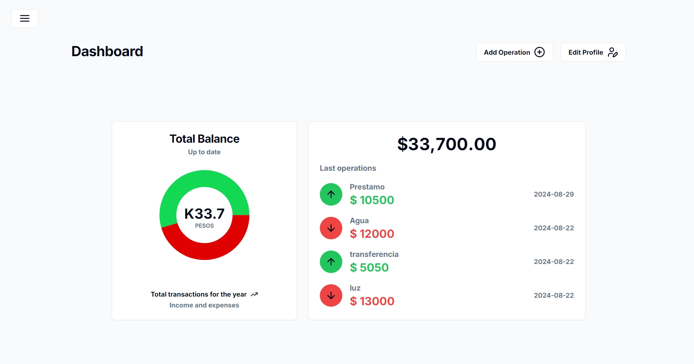

# Dashboard Bank



## Descripción

Dashboard Bank es una aplicación que permite a los usuarios gestionar sus finanzas personales. Los usuarios pueden registrarse, iniciar sesión, agregar ingresos y gastos, ver en gráficos sus operaciones, también editar los datos de su perfil. Realizada con componentes de [shadcn/ui](https://ui.shadcn.com/) y [Tailwind](https://tailwindcss.com/).

## URL del Deploy

[https://dashboard-ariel-martinezs-projects.vercel.app](https://dashboard-ariel-martinezs-projects.vercel.app/)

## Pasos para ejecutar el proyecto localmente


1. Clona el repositorio:
```sh
git clone https://github.com/Arielstereo/Dashboard.git
```

2. Navega al directorio del proyecto:
```sh
cd dashboard
```

3. Instala las dependencias:
```sh
mpm install
```

4. Crea un archivo `.env.local` en la raíz del proyecto y agrega las siguientes variables de entorno: 
```sh
MONGODB_URI=tu_mongodb_uri
JWT_SECRET_KEY=tu_jwt_secret_key
```

5. Ejecuta el servidor de desarrollo:
```sh
npm run dev
```

6. Abre [http://localhost:3000](http://localhost:3000) en tu navegador para ver la aplicación.
